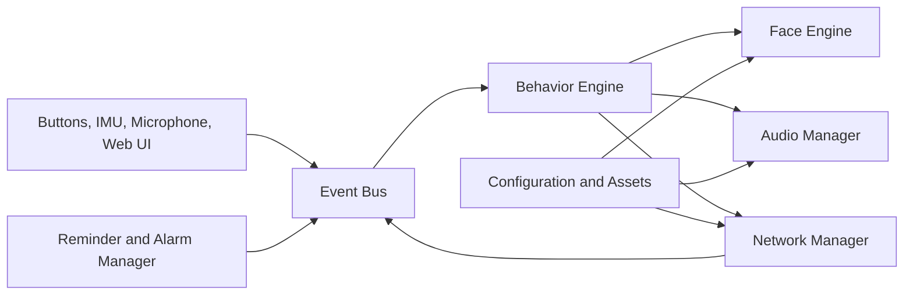

# Fire-chan Project Brief

**Version:** 0.1
**Target:** M5Stack Fire v2.5
**Purpose:** Stationary, Stack-chan-inspired desktop companion
**Excluded:** Camera and servo movement

**Implementation status (2026-08-08):** Hardware baseline, animated face,
event-driven behavior, persistent configuration, push-to-talk, and a fully
local Ember voice round trip are operational. **Firmware `0.12.0-alarm-ringing`**
adds device-ringing alarms: an alarm set on the Pi is handed to the Fire as
a Unix deadline (NTP-synced) and fires a 3-second buzzer with the Alarmed
expression, dismissable with Button B. **Gateway `0.7.2`** serves canonical
8 kHz WAV replies, deterministic local commands (time, status, help, volume,
timers, alarms, weather, web search, calculations, unit conversions), and
graceful "didn't catch that" replies on empty transcripts. The known PSRAM
fault is non-blocking because core features use bounded internal-RAM buffers.
The active backlog is in `TODO.md`; detailed evidence is in `PROJECT_PROGRESS.md`.

---

## 1. Project Goal

Fire-chan is a compact desktop companion built around the M5Stack Fire v2.5.

It keeps the useful interactive features of Stack-chan while staying stationary:

- Animated face
- Emotional expressions
- Button control
- Speaker and microphone
- Wi-Fi connectivity
- IMU gestures
- RGB status lighting
- microSD assets and configuration
- Local web control
- HTTP and optional MQTT integration
- Timers, reminders, alarms, and notifications
- Optional cloud speech and AI features

The device must remain useful even without internet access.

---

## 2. Core Features

### Required

- Animated eyes, blinking, gaze, mouth, and expressions
- Three-button interaction
- IMU reactions (tilt, shake, pickup, face-down)
- Sound playback from microSD
- RGB state indicators
- Wi-Fi setup and automatic reconnect
- Local web interface
- HTTP command API
- NTP time synchronization
- Timers, alarms, and reminders
- Configuration persistence
- OTA firmware updates
- Offline operation for core functions

### Planned or in progress

- Push-to-talk microphone recording — implemented
- Local speech-to-text on Raspberry Pi — implemented (whis.cpp `base.en`)
- Local command routing — implemented
- Text-to-speech — implemented (Piper `en_GB-alba-medium`)
- Local AI conversation — implemented (Ollama `llama3.2:3b`; optional Gemini)
- MQTT and Home Assistant integration
- Personality profiles
- Custom avatar and sound packs
- Streaming early-start playback — _attempted, rolled back_

### Excluded

- Camera
- Computer vision
- Servo movement
- Pan and tilt
- Continuous local AI model
- Continuous listening in v0.1

---

## 3. Recommended Technology

PlatformIO, Arduino framework, M5Unified, M5GFX, FreeRTOS, ArduinoJson, ESP32
Wi-Fi and HTTP libraries. Optional MQTT and audio libraries. The project is
event-driven with separate modules for hardware, animation, audio, networking,
storage, reminders, and assistant functions.

---

## 4. High-Level Architecture



Main rule: network, storage, and audio operations must not freeze the face.

---

## 5. Suggested Module Layout

```text
src/
├── app/           # Application, EventBus, BehaviorEngine
├── hardware/      # RGB feedback
├── face/          # Face engine, eyes, mouth, expressions, animation
├── input/         # Buttons, IMU gestures
├── audio/         # Audio feedback, response player
├── network/       # Wi-Fi, NTP
├── storage/       # NVS, microSD backup
├── assistant/     # Voice gateway client, directive parser
├── alarm/         # Local alarm manager (NTP-synced, 3 s buzzer)
└── ui/            # Optional web UI
```

---

## 6. Interaction Model

Button mapping:

| Input | Action |
|---|---|
| Button A (hold) | Push-to-talk |
| Button A (tap) | Dismiss ringing alarm |
| Button B (tap) | Next expression; or dismiss ringing alarm |
| Button B (hold) | Reset to neutral |
| Button C (tap) | Toggle demo / manual |
| Button C (hold) | Mute / unmute |
| Tilt | Move pupils |
| Shake | Temporary confused reaction |
| Pick up | Temporary surprised reaction |
| Face down | Sleeping expression |

Voice intents (handled locally before any LLM call):

- Time, date, status, help, repeat
- Sleep, wake, mute, unmute
- Set / list / cancel timers
- Set / list / dismiss alarms (device rings at the set time)
- Weather, web search, calculations, unit conversions
- Volume change

---

## 7. Face States

Expressions: Neutral, Happy, Excited, Sad, Surprised, Confused, Sleepy,
Sleeping, Listening, Thinking, Speaking, Alarmed, Offline, Error.

State priority:

```text
Error
> Alarm (active ringing)
> Face-down / sleeping
> Speaking
> Listening / thinking
> Temporary reaction
> Offline
> Base state
```

---

## 8. Voice Workflow

Push-to-talk. Local commands resolve before any LLM call. The gateway serves
8 kHz canonical WAV replies; the Fire downloads, caches, and plays. Alarms
ring from the device, not the gateway.

```text
Press A
→ record 16 kHz WAV to microSD
→ POST /v1/voice (with device status header)
→ gateway: whisper STT → local command or LLM → Piper TTS → 8 kHz WAV
→ Fire downloads /cache/ember_response.wav
→ face = Speaking, mouth animates
→ if reply includes alarm_time: persist to NVS, schedule local 3 s alarm
→ at alarm time: local buzzer + Alarmed expression, dismissable with B
```

---

## 9. Networking

- Wi-Fi provisioning (current: `include/secrets.h`; next: captive portal)
- Automatic reconnect with backoff
- Offline mode
- Local web interface (planned)
- HTTP API (planned)
- OTA updates (planned)

---

## 10. Storage

Internal (NVS) for essential settings: device id, volume, mute, display,
gesture, sleep, demo, max recording, **alarm deadline and label**, schema
version. microSD for face assets, sound files, web UI, logs, cached speech,
and `/config/device.json` backup. The device must boot safely without an
SD card.

---

## 11. Development Roadmap

### Phase 0 — Setup ✅

### Phase 1 — Hardware diagnostics ✅

### Phase 2 — Animated face ✅

### Phase 3 — Inputs and behavior ✅

### Phase 4 — Audio (playback, expression cues) ✅

### Phase 5 — Connectivity (Wi-Fi provisioning + OTA) — in progress

### Phase 6 — Time, timers, alarms

- Timers and reminders ✅
- NTP time synchronization ✅
- Alarm ringing on device ✅
- Snooze and missed-reminder behavior — outstanding
- Pause / resume timers — outstanding

### Phase 7 — Smart home (MQTT, Home Assistant) — outstanding

### Phase 8 — Voice assistant ✅ (streaming early-start playback rolled back)

---

## 12. First Milestone

> Fire-chan boots, shows an animated face, reacts to buttons and tilt,
> plays a sound, detects the SD card, connects to Wi-Fi, and remains stable.

This has been met. The current milestone is the closed assistant loop
(push-to-talk → reply → expression/audio) with multi-turn memory and a
device-ringing alarm.

---

## 13. Main Risks

| Risk | Mitigation |
|---|---|
| Fire v2.5 hardware differences | Verify components and pin mappings first |
| Existing Stack-chan firmware not portable | Build a Fire-specific hardware layer |
| Network operations freeze UI | Separate tasks and timeouts |
| Audio quality or conflicts | Test early, allow external audio later |
| Memory fragmentation | Fixed buffers, monitor heap |
| SD card failure | Built-in fallback assets |
| Gesture false triggers | Filtering and cooldowns |
| Incorrect alarm time | NTP sync + relative Unix deadline |
| API key exposure | Never hard-code secrets |
| Streaming playback lockup | Stay on download-then-play until serial-captured failure is fixed |

---

## 14. Open Decisions

- Device-friendly Wi-Fi provisioning flow
- Web server library
- MQTT library
- Audio playback library
- Configuration format and location
- OTA method
- Long-term STT, TTS, and conversation model upgrade policy
- Need for an external RTC (currently NTP is sufficient)
- Final repository name

---

## 15. Definition of Done for Version 0.1

Version 0.1 is complete when:

- The project builds from a clean checkout.
- The Fire v2.5 boots reliably.
- Hardware diagnostics pass.
- The animated face runs without blocking.
- Buttons and IMU generate events.
- Sounds play correctly.
- SD and Wi-Fi failures are handled safely.
- The device runs continuously without obvious crashes or memory leaks.
- Local voice round trip is stable; alarms ring on the device at the set time.

---

## 16. Final Direction

Build the project in this order:

```text
Hardware verification
→ face engine
→ input and behavior
→ local audio
→ Wi-Fi and web control
→ reminders and alarms
→ MQTT
→ voice and AI
```

Do not begin with AI integration.

The first priority is a stable, expressive, offline-capable companion with a
clean modular architecture.