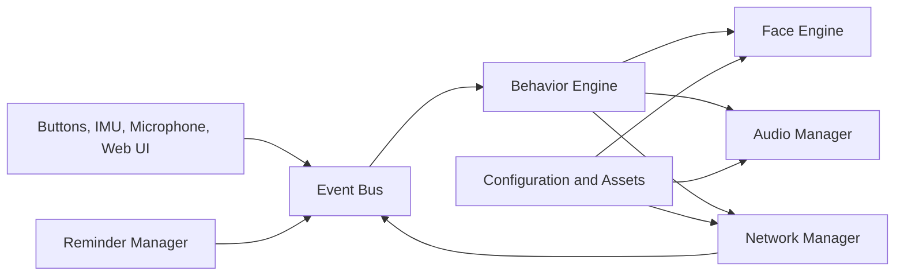

# Fire-chan Project Brief

**Version:** 0.1  
**Target:** M5Stack Fire v2.5  
**Purpose:** Stationary Stack-chan-inspired desktop companion  
**Excluded:** Camera and servo movement

**Implementation status (2026-08-04):** The hardware baseline, animated face,
event-driven behavior, persistent configuration, push-to-talk recording, and a fully
local Ember voice round trip are operational on the physical Fire v2.5. Firmware
`0.9.0-assistant-directives` uses a Raspberry Pi 5 for local STT, conversation, and
TTS, and applies returned expression, sleep, wake, mute, and unmute hints. The known
PSRAM fault is non-blocking because core features use bounded internal-RAM buffers.
The active backlog is maintained in `TODO.md`; detailed evidence is in
`PROJECT_PROGRESS.md`.

---

## 1. Project Goal

Fire-chan is a compact desktop companion built around the M5Stack Fire v2.5.

It should retain the useful interactive features of Stack-chan while remaining stationary:

- Animated face
- Emotional expressions
- Button control
- Speaker and microphone
- Wi-Fi connectivity
- IMU gestures
- RGB status lighting
- microSD assets and configuration
- Local web control
- HTTP and optional MQTT integration
- Timers, reminders, and notifications
- Optional cloud speech and AI features

The device should remain useful even without internet access.

---

## 2. Core Features

### Required

- Animated eyes, blinking, gaze, mouth, and expressions
- Three-button interaction
- IMU reactions such as tilt, shake, pickup, and face-down mute
- Sound playback from microSD
- RGB state indicators
- Wi-Fi setup and automatic reconnect
- Local web interface
- HTTP command API
- NTP time synchronization
- Timers and reminders
- Configuration persistence
- OTA firmware updates
- Offline operation for core functions

### Planned or in progress

- Push-to-talk microphone recording — implemented
- Local speech-to-text on Raspberry Pi — implemented
- Local command routing — partially implemented
- Text-to-speech — implemented with Ember's local Piper voice
- Local AI conversation — implemented; multi-turn memory remains
- MQTT and Home Assistant integration
- Personality profiles
- Custom avatar and sound packs

### Excluded

- Camera
- Computer vision
- Servo movement
- Pan and tilt
- Continuous local AI model
- Continuous listening in the first version

---

## 3. Recommended Technology

Use:

- PlatformIO
- Arduino framework
- M5Unified
- M5GFX
- FreeRTOS
- ArduinoJson
- ESP32 Wi-Fi and HTTP libraries
- Optional MQTT and audio libraries

The project should use an event-driven design with separate modules for hardware, animation, audio, networking, storage, reminders, and assistant functions.

---

## 4. High-Level Architecture



Main rule:

> Network, storage, and audio operations must not freeze the animated face.

---

## 5. Suggested Module Layout

```text
src/
├── app/
├── hardware/
├── face/
├── input/
├── audio/
├── network/
├── reminders/
├── storage/
├── assistant/
└── ui/
```

Key modules:

- Hardware abstraction
- Event bus
- Behavior engine
- Face engine
- Input manager
- Audio manager
- Network manager
- Reminder manager
- Configuration manager
- Optional assistant manager

---

## 6. Interaction Model

Suggested button mapping:

| Input | Action |
|---|---|
| Button A | Push-to-talk or acknowledge |
| Button B | Menu or confirm |
| Button C | Cancel, mute, or back |
| Long press | Settings or alternate action |
| Button combination | Safe mode or reset |

Suggested IMU actions:

- Tilt: move pupils
- Shake: dismiss alarm
- Pick up: surprised reaction
- Face down: mute or sleep
- Inactivity: sleepy state

---

## 7. Face States

Initial expressions:

- Neutral
- Happy
- Sad
- Surprised
- Confused
- Sleepy
- Sleeping
- Listening
- Thinking
- Speaking
- Alarm
- Offline
- Error

State priority:

```text
Error
> Alarm
> OTA update
> Active interaction
> Listening or speaking
> Temporary expression
> Idle behavior
```

---

## 8. Voice Workflow

The first version should use push-to-talk.

```text
Press button
→ record speech
→ speech-to-text
→ local command or AI service
→ text response
→ text-to-speech
→ play audio with mouth animation
```

Local commands should be handled before sending requests to an AI service.

Examples:

- Set timer
- Cancel timer
- Change expression
- Adjust volume
- Report status
- Trigger sound
- Run smart-home action

---

## 9. Networking

Required network features:

- Wi-Fi provisioning
- Automatic reconnect
- Offline mode
- Local web interface
- HTTP API
- OTA updates

Example API actions:

```text
GET  /api/status
POST /api/expression
POST /api/speak
POST /api/sound
POST /api/timer
POST /api/reminder
POST /api/volume
POST /api/mute
POST /api/restart
```

MQTT can be added later for Home Assistant and external automation.

---

## 10. Storage

Use internal storage for:

- Essential settings
- Device state
- Safe-mode flags

Use microSD for:

- Face assets
- Sound files
- Web UI files
- Personality profiles
- Logs
- Cached speech
- Configuration backups

The device must boot safely without an SD card.

---

## 11. Development Roadmap

### Phase 0 — Setup

- Create repository
- Configure PlatformIO
- Add M5Unified and M5GFX
- Confirm build and upload
- Add logging and versioning

### Phase 1 — Hardware diagnostics

Test:

- Display
- Buttons
- Speaker
- Microphone
- IMU
- RGB LEDs
- microSD
- Wi-Fi
- Battery information
- PSRAM and memory

### Phase 2 — Animated face

- Eyes
- Blinking
- Gaze
- Mouth
- Expressions
- Idle animation
- Non-blocking rendering

### Phase 3 — Inputs and behavior

- Button events
- IMU gestures
- Event bus
- Behavior state machine
- Sleep and wake behavior

### Phase 4 — Audio

- Sound playback
- Volume and mute
- Alarm sounds
- Mouth animation during speech

### Phase 5 — Connectivity

- Wi-Fi provisioning
- Web UI
- HTTP API
- OTA
- Status reporting

### Phase 6 — Time and reminders

- NTP
- Timers
- Reminders
- Persistence
- Snooze and dismiss

### Phase 7 — Smart home

- MQTT
- Home Assistant
- External notifications

### Phase 8 — Voice assistant

- Push-to-talk
- Speech-to-text
- Local command routing
- AI integration
- Text-to-speech

---

## 12. First Milestone

The first meaningful milestone is:

> Fire-chan boots, shows an animated face, reacts to buttons and tilt, plays a sound, detects the SD card, connects to Wi-Fi, and remains stable.

Recommended first coding session:

1. Create the PlatformIO project.
2. Initialize M5Unified.
3. Show firmware version.
4. Test all three buttons.
5. Draw simple eyes.
6. Add non-blocking blinking.
7. Move pupils using IMU tilt.
8. Trigger expressions from buttons.
9. Play a sound.
10. Initialize the SD card and Wi-Fi.

---

## 13. Main Risks

| Risk | Mitigation |
|---|---|
| Fire v2.5 hardware differences | Verify components and pin mappings first |
| Existing Stack-chan firmware not portable | Build a Fire-specific hardware layer |
| Network operations freeze UI | Use separate tasks and timeouts |
| Audio quality or conflicts | Test early and allow external audio later |
| Memory fragmentation | Use fixed buffers and monitor heap |
| SD card failure | Include built-in fallback assets |
| Gesture false triggers | Use filtering and cooldowns |
| Incorrect reminder time | Track NTP sync and consider an RTC |
| API key exposure | Never hard-code secrets |
| Project scope becomes too large | Follow the phased roadmap |

---

## 14. Open Decisions

- Device-friendly Wi-Fi provisioning flow
- Web server library
- MQTT library
- Audio playback library
- Configuration format and location
- OTA method
- Long-term STT, TTS, and conversation model upgrade policy
- Need for an external RTC
- Final repository name

---

## 15. Definition of Done for Version 0.1

Version 0.1 is complete when:

- The project builds from a clean checkout.
- The Fire v2.5 boots reliably.
- Hardware diagnostics pass.
- The animated face runs without blocking.
- Buttons and IMU generate events.
- Sounds play correctly.
- SD and Wi-Fi failures are handled safely.
- The device runs continuously without obvious crashes or memory leaks.

---

## 16. Final Direction

Build the project in this order:

```text
Hardware verification
→ face engine
→ input and behavior
→ local audio
→ Wi-Fi and web control
→ reminders
→ MQTT
→ voice and AI
```

Do not begin with AI integration.

The first priority is a stable, expressive, offline-capable companion with a clean modular architecture.
