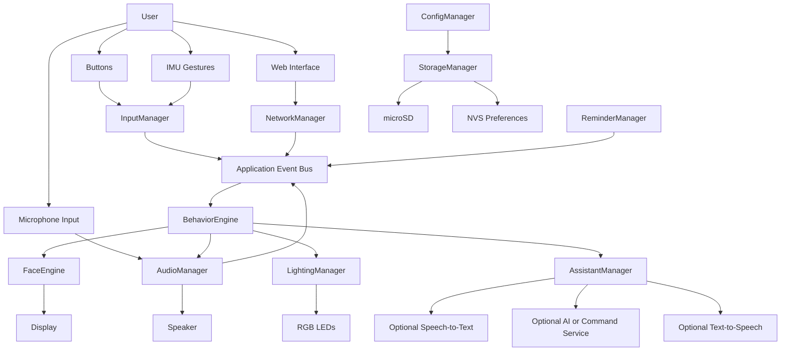
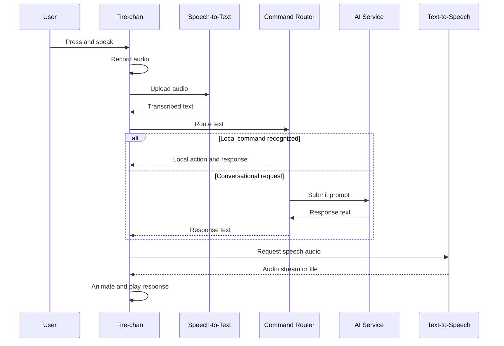

# Fire-chan Project Design Specification

**Version:** 0.1  
**Status:** Initial design baseline  
**Target platform:** M5Stack Fire v2.5  
**Project type:** Stationary, open-source desktop companion  
**Date:** 2026-08-04

> **Living-document update — 2026-08-04:** The first hardware milestone and the
> local voice-assistant path have been implemented on the physical target. Current
> firmware is `0.9.0-assistant-directives`; Ember runs fully locally through a
> Raspberry Pi 5 using whisper.cpp, Ollama, and Piper. Push-to-talk, streamed reply
> playback, expression hints, and sleep/wake/mute/unmute actions work without PSRAM.
> PSRAM remains a separate hardware finding rather than a core requirement. See
> `PROJECT_PROGRESS.md`, `DECISIONS.md`, and `TODO.md` for verified results and the
> active implementation backlog.

---

## 1. Executive Summary

Fire-chan is a stationary desktop companion inspired by the open Stack-chan platform and adapted for the **M5Stack Fire v2.5**.

The design intentionally excludes:

- Camera functionality
- Servo-driven movement
- Pan-and-tilt mechanisms

The project retains the other major companion-device capabilities discussed for Stack-chan:

- Animated face and emotional expressions
- Button-based interaction
- Audio playback
- Microphone input
- Text-to-speech
- Wi-Fi connectivity
- HTTP-based remote control
- Optional MQTT and Home Assistant integration
- IMU-based gestures
- RGB status lighting
- microSD-based assets and configuration
- Timers, alarms, and reminders
- Expandable sensors and peripherals
- Optional cloud-assisted voice and AI interaction
- Custom personalities, avatars, and behavior profiles

The recommended implementation is an **Arduino/PlatformIO** project using:

- M5Unified
- M5GFX
- FreeRTOS
- ArduinoJson
- ESP32 networking libraries
- Optional MQTT, web server, speech, and AI service libraries

The first objective is not to recreate every feature at once. The project should begin with a stable hardware abstraction layer and diagnostic firmware, followed by the animated face engine, input handling, networking, audio, reminders, and finally online assistant functionality.

---

## 2. Project Vision

Fire-chan should feel like a small, expressive presence on a desk rather than a conventional control panel.

Its personality will come from coordinated use of:

- Eye movement
- Blinking
- Mouth animation
- Facial expressions
- Sound effects
- Spoken responses
- RGB lighting
- Button interactions
- Tilt, shake, and orientation gestures
- Idle behavior
- Context-sensitive reactions

Although the device will not move physically, animation timing and responsive behavior should create the impression that it is attentive and alive.

### 2.1 Proposed product statement

> Fire-chan is a stationary, open-source M5Stack Fire desktop companion with an animated face, voice interaction, reminders, remote HTTP and MQTT control, audio, IMU gestures, RGB feedback, and expandable IoT functionality.

### 2.2 Design principles

1. **Modular:** Hardware, UI, networking, audio, and application logic remain separate.
2. **Responsive:** The face must continue animating during network and storage operations.
3. **Offline-first where practical:** Core animation, sounds, controls, timers, and configuration should work without internet access.
4. **Cloud-optional:** Speech recognition, high-quality text-to-speech, and AI services are optional extensions.
5. **Recoverable:** Configuration and firmware failures should be easy to diagnose and reset.
6. **Customizable:** Faces, sounds, expressions, and behavior profiles should be replaceable without redesigning the firmware.
7. **Incremental:** Each subsystem should be testable independently before integration.

---

## 3. Scope

### 3.1 In scope

- M5Stack Fire v2.5 hardware support
- Animated face rendering
- Emotional state and expression engine
- Three-button input
- Speaker output
- Microphone capture
- Wi-Fi provisioning and reconnection
- Local web interface
- HTTP command API
- RGB status effects
- IMU gestures
- microSD asset loading
- Timers and reminders
- NTP time synchronization
- Configuration persistence
- OTA firmware updates
- Optional MQTT support
- Optional Home Assistant integration
- Optional online speech-to-text
- Optional cloud text-to-speech
- Optional conversational AI service
- Optional external sensors through Grove or M-BUS

### 3.2 Out of scope for the initial design

- Camera input
- Facial recognition
- Computer vision
- Servo movement
- Pan-and-tilt mechanisms
- Locomotion
- Continuous local large-language-model inference
- Production-grade acoustic echo cancellation
- Commercial smart-speaker audio quality
- Official Stack-chan application compatibility
- Guaranteed compatibility with existing Core2 or CoreS3 Stack-chan firmware

---

## 4. Functional Mapping

| Stack-chan-style function | Fire-chan implementation | Status |
|---|---|---|
| Animated face | M5GFX-rendered face on the built-in display | Required |
| Eye movement | Software-rendered gaze and idle movement | Required |
| Blinking | Timed and state-dependent animation | Required |
| Emotional expressions | Expression state machine | Required |
| Mouth animation | Timed animation or audio-level-driven motion | Required |
| Sound effects | WAV or supported audio assets from microSD | Required |
| Text-to-speech | Local clips or online TTS | Planned |
| Voice input | Push-to-talk microphone recording | Planned |
| Button actions | Three front buttons, including long-press actions | Required |
| Wi-Fi | ESP32 Wi-Fi | Required |
| Bluetooth | Available for future use | Optional |
| HTTP commands | Local REST-like API | Required |
| Web interface | Local mobile-friendly control page | Required |
| Custom avatars | Asset packs stored on microSD | Planned |
| Custom behavior | Configuration profiles and later scripting | Planned |
| IMU interaction | Tilt, shake, pickup, and face-down actions | Required |
| RGB feedback | Listening, thinking, speaking, alarm, and error states | Required |
| Battery operation | Existing Fire battery system | Supported |
| Expansion | Grove and M-BUS peripherals | Supported |
| Camera | Omitted | Excluded |
| Servo movement | Omitted | Excluded |
| Touchscreen | Replaced by buttons, gestures, and web UI | Replaced |

---

## 5. Hardware Platform

## 5.1 Core device

The target is the **M5Stack Fire v2.5** module and its associated base.

Expected useful resources include:

- ESP32 processor
- 320 × 240 color display
- Built-in buttons
- Speaker
- Microphone
- IMU
- RGB LEDs
- Wi-Fi
- Bluetooth
- microSD slot
- Battery
- Grove connector
- M-BUS expansion

Exact component revisions, GPIO assignments, audio routing, IMU model, and peripheral conflicts must be confirmed against the documentation and physical unit before low-level implementation.

## 5.2 Minimum development hardware

- M5Stack Fire v2.5
- Compatible USB cable
- Stable USB power source
- microSD card
- Development computer
- Wi-Fi network
- Optional serial monitor
- Optional logic analyzer for peripheral debugging

## 5.3 Optional hardware

- External I²C RTC
- PIR presence sensor
- Ambient-light sensor
- Temperature and humidity sensor
- External speaker or audio amplifier
- External microphone module
- Capacitive touch sensor
- NFC or RFID reader
- IR transmitter
- Environmental sensors
- Custom 3D-printed enclosure or desk stand

## 5.4 Preliminary bill of materials

| Item | Quantity | Priority | Notes |
|---|---:|---|---|
| M5Stack Fire v2.5 | 1 | Essential | Main controller |
| USB cable | 1 | Essential | Programming and power |
| USB power supply | 1 | Essential | Stable bench operation |
| microSD card | 1 | Recommended | Assets, configuration, logs |
| Grove cable | 1 | Optional | External sensors |
| RTC module | 1 | Optional | Better offline reminder resilience |
| External audio hardware | 1 | Optional | Improved sound quality |
| Printed enclosure/stand | 1 | Optional | Stationary desktop presentation |

---

## 6. User Interaction Model

## 6.1 Primary controls

The Fire's three front buttons will replace touchscreen interaction.

Suggested defaults:

| Input | Default action |
|---|---|
| Button A short press | Start push-to-talk or acknowledge |
| Button B short press | Open menu or confirm selection |
| Button C short press | Cancel, mute, or return |
| Button A long press | Wi-Fi or voice settings |
| Button B long press | Main configuration menu |
| Button C long press | Sleep or power-related menu |
| A + C | Emergency reset or safe-mode request |
| Double-click | Context-specific shortcut |

The final mapping should be configurable.

## 6.2 IMU gestures

Potential gestures:

- Tilt left or right: eyes follow the tilt
- Tilt forward or backward: expression or menu adjustment
- Shake: dismiss alarm or trigger a reaction
- Pick up: surprised or attentive response
- Face down: mute or sleep
- Sudden movement: startled expression
- Long inactivity: sleepy state

Gesture thresholds must include filtering and cooldowns to prevent accidental triggers.

## 6.3 Visual feedback

The face is the primary interface. It should communicate state without requiring text.

Suggested states:

- Idle
- Listening
- Thinking
- Speaking
- Happy
- Sad
- Surprised
- Confused
- Sleepy
- Sleeping
- Alarm
- Notification
- Offline
- Error
- Updating

## 6.4 RGB feedback

Suggested patterns:

| State | RGB behavior |
|---|---|
| Listening | Slow pulse |
| Thinking | Rotating or alternating pattern |
| Speaking | Audio-reactive or rhythmic pulse |
| Alarm | High-visibility repeating flash |
| Notification | Short repeating pulse |
| Wi-Fi setup | Distinct provisioning pattern |
| Offline | Occasional status blink |
| Error | Repeating fault code |
| Battery warning | Low-frequency warning pulse |

Colors should be configurable and not be the only means of conveying critical status.

---

## 7. System Architecture



## 7.1 Architectural layers

### Hardware abstraction layer

Provides stable interfaces to:

- Display
- Buttons
- Speaker
- Microphone
- IMU
- RGB LEDs
- microSD
- Battery information
- Wi-Fi
- Optional external buses

Application code should not manipulate low-level hardware directly.

### Service layer

Includes:

- Animation timing
- Audio playback and recording
- Network management
- Time synchronization
- Storage
- Configuration
- Logging
- OTA updates
- MQTT
- Web server
- Reminder scheduling

### Application layer

Includes:

- Behavior engine
- Personality
- Expressions
- Menus
- Commands
- Assistant workflow
- Notification routing
- Smart-home actions

---

## 8. Recommended Software Stack

## 8.1 Development environment

**Recommended:** PlatformIO with Arduino framework.

Reasons:

- Repeatable dependency management
- Repository-friendly configuration
- Multiple build environments
- Serial monitor integration
- Easier CI automation
- Cleaner separation of source and configuration

Arduino IDE can still be used for early experiments, but PlatformIO is preferable for the main project.

## 8.2 Core libraries

Potential dependencies:

- `M5Unified`
- `M5GFX`
- `ArduinoJson`
- ESP32 Wi-Fi libraries
- ESP32 HTTP client
- ESP32 web server or asynchronous web server
- MQTT client
- NTP/time libraries
- SD and filesystem libraries
- Audio decoding or playback library
- OTA update library

Library versions should be pinned after the first stable build.

## 8.3 FreeRTOS task model

Suggested tasks:

| Task | Responsibility | Priority guidance |
|---|---|---|
| UI task | Face rendering and display refresh | High |
| Input task | Buttons and IMU polling | Medium-high |
| Audio task | Playback and recording | High during use |
| Network task | Wi-Fi, HTTP, MQTT | Medium |
| Reminder task | Timers, alarms, time checks | Medium |
| Storage task | Deferred SD writes and asset loading | Low-medium |
| Application task | Behavior and event routing | Medium |
| Watchdog/health task | Liveness and diagnostics | Low |

Long network requests must never block face animation.

## 8.4 Event-driven design

Subsystems should communicate through events instead of directly calling each other wherever possible.

Example events:

```text
BUTTON_A_PRESSED
BUTTON_A_LONG_PRESSED
DEVICE_PICKED_UP
DEVICE_FACE_DOWN
SHAKE_DETECTED
WIFI_CONNECTED
WIFI_DISCONNECTED
TIMER_EXPIRED
REMINDER_DUE
VOICE_RECORDING_STARTED
VOICE_RECORDING_COMPLETE
ASSISTANT_RESPONSE_READY
AUDIO_PLAYBACK_STARTED
AUDIO_PLAYBACK_COMPLETE
BATTERY_LOW
SD_CARD_ERROR
OTA_STARTED
OTA_COMPLETE
```

---

## 9. Proposed Repository Structure

```text
fire-chan/
├── platformio.ini
├── README.md
├── LICENSE
├── CHANGELOG.md
├── DECISIONS.md
├── docs/
│   ├── Fire-chan_Project_Design_Specification_v0.1.md
│   ├── hardware-notes.md
│   ├── api.md
│   ├── asset-format.md
│   └── troubleshooting.md
├── include/
│   ├── app_config.h
│   ├── build_config.h
│   └── version.h
├── src/
│   ├── main.cpp
│   ├── app/
│   │   ├── Application.cpp
│   │   ├── EventBus.cpp
│   │   ├── BehaviorEngine.cpp
│   │   └── Personality.cpp
│   ├── hardware/
│   │   ├── DisplayDevice.cpp
│   │   ├── ButtonDevice.cpp
│   │   ├── AudioDevice.cpp
│   │   ├── ImuDevice.cpp
│   │   ├── RgbDevice.cpp
│   │   ├── StorageDevice.cpp
│   │   └── PowerDevice.cpp
│   ├── face/
│   │   ├── FaceEngine.cpp
│   │   ├── EyeRenderer.cpp
│   │   ├── MouthRenderer.cpp
│   │   ├── Expression.cpp
│   │   └── AnimationScheduler.cpp
│   ├── audio/
│   │   ├── AudioManager.cpp
│   │   ├── SoundPlayer.cpp
│   │   ├── Recorder.cpp
│   │   └── SpeechOutput.cpp
│   ├── input/
│   │   ├── InputManager.cpp
│   │   ├── ButtonHandler.cpp
│   │   └── GestureDetector.cpp
│   ├── network/
│   │   ├── NetworkManager.cpp
│   │   ├── WebServer.cpp
│   │   ├── HttpApi.cpp
│   │   ├── MqttClient.cpp
│   │   └── OtaManager.cpp
│   ├── assistant/
│   │   ├── AssistantManager.cpp
│   │   ├── SpeechToTextClient.cpp
│   │   ├── ConversationClient.cpp
│   │   ├── CommandRouter.cpp
│   │   └── TextToSpeechClient.cpp
│   ├── reminders/
│   │   ├── ReminderManager.cpp
│   │   ├── Timer.cpp
│   │   └── ClockService.cpp
│   ├── storage/
│   │   ├── ConfigManager.cpp
│   │   ├── AssetManager.cpp
│   │   └── LogManager.cpp
│   └── ui/
│       ├── Menu.cpp
│       ├── StatusOverlay.cpp
│       └── ProvisioningScreen.cpp
├── data/
│   ├── config/
│   ├── faces/
│   ├── sounds/
│   ├── web/
│   └── personalities/
├── test/
│   ├── test_event_bus/
│   ├── test_reminders/
│   └── test_config/
└── tools/
    ├── asset_packer.py
    └── upload_assets.py
```

---

## 10. Face and Animation Engine

## 10.1 Objectives

The face engine must:

- Render smoothly
- Avoid blocking operations
- Support multiple expressions
- Allow independent eye and mouth animation
- Support random idle behavior
- React immediately to events
- Load optional assets from microSD
- Provide simple APIs to the rest of the application

## 10.2 Core components

### Eyes

Functions:

- Blink
- Half-blink
- Look left, right, up, and down
- Track tilt
- Widen for surprise
- Narrow for suspicion or sleepiness
- Close for sleep
- Offset independently for comedic expressions

### Mouth

Functions:

- Neutral
- Smile
- Frown
- Open
- Speaking animation
- Small “o” surprise
- Flat or uncertain
- Optional amplitude-driven lip movement

### Expression presets

Initial presets:

- Neutral
- Happy
- Excited
- Sad
- Surprised
- Confused
- Sleepy
- Sleeping
- Listening
- Thinking
- Speaking
- Alarmed
- Offline
- Error

## 10.3 Animation scheduler

The scheduler should combine:

- Base emotional state
- Temporary reaction
- Idle animation
- User input
- Audio state
- Network state
- Reminder state

Priority example:

```text
Critical error
> Alarm
> OTA update
> Active user interaction
> Speaking/listening
> Temporary emotion
> Idle behavior
```

## 10.4 Rendering strategy

Options:

1. Primitive shapes using M5GFX
2. Sprite-based rendering
3. Hybrid vector and bitmap rendering

The first version should use simple primitives and sprites. This minimizes asset complexity and allows expressions to scale and animate easily.

---

## 11. Audio and Voice

## 11.1 Initial audio functionality

Version 1 should support:

- Startup sound
- Button feedback sounds
- Expression sounds
- Alarm sounds
- WAV playback from microSD
- Volume setting
- Mute mode

## 11.2 Voice recording

The recommended first interaction is **push-to-talk**:

1. User presses Button A.
2. Face changes to listening.
3. RGB indicates recording.
4. Device records a short audio segment.
5. Recording stops on release, silence timeout, or maximum duration.
6. Audio is submitted to an optional speech-to-text service.
7. Text is routed to commands or an AI service.
8. Response is converted to speech.
9. Fire-chan plays the response while animating the mouth.
10. Device returns to idle.

Push-to-talk is preferable to continuous wake-word detection for the first release because it:

- Reduces false activation
- Reduces processing load
- Reduces network usage
- Simplifies privacy expectations
- Avoids speaker-to-microphone feedback during playback

## 11.3 Audio limitations

Expected challenges:

- Built-in microphone quality
- Speaker loudness and clarity
- Acoustic feedback
- Limited local DSP resources
- Audio buffer sizing
- Concurrent display and audio workload
- Service latency

The initial implementation should not record while speaking. Full-duplex conversation and acoustic echo cancellation are future work.

---

## 12. Assistant and Command Workflow



## 12.1 Command router

Local commands should be attempted before sending text to an external AI service.

Examples:

- Set a timer
- Cancel a timer
- Report the time
- Change expression
- Adjust volume
- Mute
- Show system status
- Trigger a sound
- Run a smart-home action
- Enter sleep mode
- Reconnect Wi-Fi

This reduces latency and allows basic operation during cloud outages.

## 12.2 AI integration

A remote AI service may support:

- General questions
- Conversational responses
- Personality-consistent wording
- Summaries
- Smart-home intent interpretation
- Creative responses

API keys must not be hard-coded into public source files. Store secrets in a local untracked file, provisioning flow, or secure configuration mechanism.

---

## 13. Networking

## 13.1 Wi-Fi lifecycle

The network manager should support:

- Saved credentials
- Startup connection attempt
- Automatic reconnection
- Connection timeout
- Offline mode
- Captive-portal or temporary access-point provisioning
- Signal-strength reporting
- Status events
- Credential reset

Core face and button features must remain functional when Wi-Fi is unavailable.

## 13.2 Local web interface

The web UI should support:

- Device status
- Expression selection
- Text-to-speech input
- Sound trigger
- Volume and brightness
- Timer and reminder creation
- Wi-Fi settings
- Personality selection
- Asset management
- Restart
- OTA update
- Log viewing
- MQTT configuration

The interface should be mobile-friendly and served from flash or microSD.

## 13.3 HTTP API

Example endpoints:

```text
GET  /api/status
GET  /api/config
POST /api/expression
POST /api/speak
POST /api/sound
POST /api/timer
POST /api/reminder
POST /api/volume
POST /api/brightness
POST /api/mute
POST /api/sleep
POST /api/restart
POST /api/config
```

Example request:

```json
{
  "expression": "happy",
  "duration_ms": 3000
}
```

Example status response:

```json
{
  "name": "Fire-chan",
  "version": "0.1.0",
  "state": "idle",
  "expression": "neutral",
  "wifi_connected": true,
  "ip_address": "xxx.xxx.xxx.xxx",
  "volume": 65,
  "brightness": 70,
  "muted": false,
  "sd_available": true,
  "time_synchronized": true
}
```

## 13.4 MQTT

Suggested topics:

```text
firechan/status
firechan/state
firechan/expression
firechan/command
firechan/speak
firechan/sound
firechan/timer
firechan/reminder
firechan/availability
```

MQTT should use authentication when supported by the broker. TLS may be desirable but must be evaluated against memory constraints.

---

## 14. Time, Timers, and Reminders

## 14.1 Clock sources

Primary:

- NTP time after Wi-Fi connection

Optional:

- External RTC for better resilience when offline or powered down

## 14.2 Timer features

- Multiple concurrent timers
- Countdown display
- Spoken or audible completion
- Button acknowledgement
- Shake-to-dismiss option
- Persistence where appropriate

## 14.3 Reminder features

- One-time reminders
- Daily reminders
- Weekly reminders
- Named reminders
- Spoken announcement
- Visual notification
- RGB indication
- Snooze
- Dismiss
- Persistent storage

## 14.4 Reliability requirements

- Store reminders in persistent configuration
- Re-evaluate overdue reminders after restart
- Track whether time is synchronized
- Avoid firing reminders at incorrect times before time sync
- Display a clear unsynchronized-clock warning
- Define behavior for daylight-saving or timezone changes

Default project timezone may be configured as `Africa/Johannesburg`, but timezone must remain user-configurable.

---

## 15. Storage and Asset Management

## 15.1 Storage responsibilities

### Internal flash or NVS

Use for:

- Essential settings
- Wi-Fi metadata
- Device identity
- Last-known state
- Boot counters
- Safe-mode flags

### microSD

Use for:

- Face assets
- Audio files
- Web UI files
- Personality profiles
- Logs
- Cached TTS
- Optional recordings
- User configuration backups

## 15.2 Suggested SD layout

```text
/
├── config/
│   ├── device.json
│   ├── network.json
│   ├── mqtt.json
│   └── assistant.json
├── faces/
│   ├── default/
│   └── custom/
├── sounds/
│   ├── system/
│   ├── expressions/
│   └── alarms/
├── personalities/
│   ├── default.json
│   └── custom.json
├── web/
│   ├── index.html
│   ├── app.js
│   └── styles.css
├── cache/
└── logs/
```

## 15.3 Configuration example

```json
{
  "device": {
    "name": "Fire-chan",
    "timezone": "Africa/Johannesburg",
    "brightness": 70,
    "volume": 65,
    "mute": false
  },
  "face": {
    "theme": "default",
    "idle_animation": true,
    "blink_min_ms": 2500,
    "blink_max_ms": 6500
  },
  "network": {
    "hostname": "fire-chan",
    "mqtt_enabled": false
  },
  "assistant": {
    "enabled": false,
    "push_to_talk": true,
    "max_recording_seconds": 12
  }
}
```

---

## 16. Personality and Customization

## 16.1 Personality profile

A profile may define:

- Name
- Default expression
- Idle animation frequency
- Sound pack
- Speech style
- Greeting
- Response length preference
- RGB theme
- Sleep behavior
- Reaction probabilities

Example:

```json
{
  "name": "Fire-chan",
  "greeting": "Hello. Systems ready.",
  "default_expression": "neutral",
  "voice": "default",
  "speech_style": "friendly_concise",
  "rgb_theme": "warm",
  "idle": {
    "blink_rate": "normal",
    "random_glances": true,
    "sleep_after_minutes": 20
  }
}
```

## 16.2 Future scripting

A later version may allow behavior scripts or declarative rules.

Example concept:

```text
WHEN mqtt_message("home/door/front", "open")
THEN expression("surprised", 2000)
AND sound("door_open.wav")
AND speak("The front door opened.")
```

Scripting should not be introduced until the native event system is stable.

---

## 17. Diagnostics and Observability

## 17.1 Serial logging

Log levels:

- ERROR
- WARN
- INFO
- DEBUG
- TRACE

Production builds should default to INFO or WARN.

## 17.2 On-device diagnostics

A diagnostics menu should show:

- Firmware version
- Build date
- Uptime
- Free heap
- PSRAM status
- SD status
- Wi-Fi status
- IP address
- RSSI
- Time synchronization
- IMU status
- Audio status
- Last error
- Reset reason

## 17.3 Hardware diagnostic firmware

Before developing the full application, create a diagnostic build that tests:

1. Display
2. Buttons
3. Speaker
4. Microphone
5. IMU
6. RGB LEDs
7. microSD
8. Wi-Fi
9. Battery reporting
10. Grove and M-BUS access where needed

The diagnostic firmware should be retained as a separate PlatformIO environment.

---

## 18. Security and Privacy

## 18.1 Secrets

Do not commit:

- Wi-Fi passwords
- API keys
- MQTT credentials
- Cloud service tokens
- Personal endpoints

Use ignored local configuration, runtime provisioning, or encrypted storage where practical.

## 18.2 Voice privacy

The UI must clearly indicate when recording is active.

Recommended safeguards:

- Push-to-talk by default
- Visible listening expression
- RGB recording indicator
- Maximum recording duration
- Local deletion after upload
- Optional disable switch in settings
- No background recording in Version 1

## 18.3 Local API security

For trusted home networks, a simple token may be sufficient during development. Later versions should consider:

- Authentication token
- Restricted local-network access
- CSRF protection
- Input validation
- Rate limiting
- Secure OTA process
- TLS where feasible

---

## 19. Reliability and Failure Handling

## 19.1 Safe mode

Enter safe mode when:

- Repeated boot failures occur
- Configuration parsing fails
- SD assets cause repeated crashes
- A specific button combination is held during startup

Safe mode should:

- Use built-in default assets
- Disable optional network services
- Disable assistant functions
- Start a minimal configuration interface
- Expose diagnostics
- Allow configuration reset

## 19.2 Watchdog strategy

Each long-running task should:

- Avoid indefinite blocking
- Report liveness
- Use timeouts
- Recover from network errors
- Release resources on failure

## 19.3 Offline behavior

When offline, Fire-chan should still support:

- Face animation
- Buttons
- IMU gestures
- Sounds
- Local timers
- Previously stored reminders, subject to reliable time
- Menus
- Diagnostics
- RGB feedback

---

## 20. Development Roadmap

## Phase 0 — Repository and toolchain

Deliverables:

- Git repository
- PlatformIO project
- Build and upload confirmed
- Serial logging
- Version header
- Basic documentation
- `DECISIONS.md`
- Coding conventions

Exit criteria:

- Reproducible clean build
- Firmware boots on the Fire v2.5
- Version appears on serial and display

## Phase 1 — Hardware diagnostics

Deliverables:

- Display test
- Button test
- Speaker test
- Microphone test
- IMU test
- RGB test
- SD test
- Wi-Fi test
- Power information test

Exit criteria:

- Every required subsystem has a pass/fail diagnostic
- Actual hardware details and pin conflicts are documented

## Phase 2 — Face engine

Deliverables:

- Neutral face
- Blinking
- Gaze movement
- Expression presets
- Animation scheduler
- Frame-rate measurement
- Non-blocking rendering

Exit criteria:

- Stable animation during button and SD activity
- No visible flicker during normal use

## Phase 3 — Input and behavior

Deliverables:

- Button actions
- Long press and double click
- IMU gesture filtering
- Event bus
- Behavior state machine
- Idle and sleep behavior

Exit criteria:

- Inputs trigger predictable reactions
- Accidental gestures are acceptably rare

## Phase 4 — Local audio

Deliverables:

- Sound playback
- microSD sound packs
- Volume and mute
- Alarm playback
- Speaking mouth animation

Exit criteria:

- Reliable playback without freezing UI
- Recoverable handling of missing files

## Phase 5 — Networking and web UI

Deliverables:

- Wi-Fi provisioning
- Reconnect logic
- Local web page
- HTTP API
- Device status
- OTA updates

Exit criteria:

- Device is controllable from a phone browser
- Network loss does not stop local functions

## Phase 6 — Time and reminders

Deliverables:

- NTP
- Timezone handling
- Timers
- Reminders
- Persistence
- Snooze and dismiss behavior

Exit criteria:

- Timers remain reliable during normal operation
- Reminders recover safely after restart

## Phase 7 — MQTT and smart home

Deliverables:

- MQTT connection
- Command and status topics
- Availability
- Home Assistant examples

Exit criteria:

- Expression, speech, and notifications can be triggered externally

## Phase 8 — Voice assistant

Deliverables:

- Push-to-talk recording
- Speech-to-text client
- Local command router
- Optional AI service
- Text-to-speech playback
- Assistant state animations

Exit criteria:

- End-to-end interaction works reliably
- Failure cases are visible and recoverable

## Phase 9 — Customization and packaging

Deliverables:

- Personality profiles
- Avatar packs
- Sound packs
- Configuration export/import
- User documentation
- Installation guide

Exit criteria:

- A new user can flash, configure, and customize the device without editing source code

---

## 21. Version Targets

## Version 0.1 — Hardware baseline

- Project builds
- Hardware diagnostics
- Display, buttons, RGB, IMU, speaker, SD, and Wi-Fi verified

## Version 0.2 — Animated companion

- Face engine
- Expressions
- Idle behavior
- Buttons
- IMU reactions
- Sounds

## Version 0.3 — Connected companion

- Wi-Fi provisioning
- Web interface
- HTTP API
- OTA
- NTP
- Timers and reminders

## Version 0.4 — Smart-home companion

- MQTT
- Home Assistant integration
- External notification actions

## Version 0.5 — Voice companion

- Push-to-talk
- Speech-to-text
- Local command routing
- AI integration
- Text-to-speech

## Version 1.0 — Stable release

- Installation documentation
- Safe mode
- Configuration backup
- Personality and asset packs
- Tested upgrade path
- Known limitations documented

---

## 22. Initial Implementation Checklist

### Repository

- [ ] Create Git repository
- [x] Add license — Apache-2.0
- [x] Add README
- [x] Add this design specification
- [x] Add `DECISIONS.md`
- [x] Add `.gitignore`
- [x] Add versioning scheme

### Toolchain

- [ ] Install PlatformIO
- [ ] Create Fire v2.5 environment
- [ ] Add M5Unified
- [ ] Add M5GFX
- [ ] Pin dependency versions
- [ ] Confirm serial monitor
- [ ] Confirm upload

### Diagnostics

- [ ] Display
- [ ] Buttons
- [ ] Speaker
- [ ] Microphone
- [ ] IMU
- [ ] RGB
- [ ] microSD
- [ ] Wi-Fi
- [ ] Battery
- [ ] Memory and PSRAM

### Architecture

- [ ] Hardware abstraction interfaces
- [ ] Event definitions
- [ ] Logging
- [ ] Configuration manager
- [ ] Safe default configuration
- [ ] Task ownership rules

### Face engine

- [ ] Sprite buffer
- [ ] Neutral expression
- [ ] Blink
- [ ] Gaze
- [ ] Mouth
- [ ] Expression transitions
- [ ] Idle scheduler

---

## 23. Recommended First Coding Session

The first coding session should not begin with AI, web APIs, or voice services.

Recommended sequence:

1. Create the PlatformIO project.
2. Boot M5Unified.
3. Display firmware version and hardware status.
4. Read all three buttons.
5. Draw a simple pair of eyes.
6. Add timed blinking without using long blocking delays.
7. Read the IMU and move the pupils based on tilt.
8. Trigger expressions from the buttons.
9. Test speaker playback.
10. Add SD initialization and a simple asset check.

The first meaningful milestone is:

> Fire-chan boots, displays an animated face, responds to buttons and tilt, and remains stable for an extended period.

---

## 24. Key Technical Risks

| Risk | Impact | Mitigation |
|---|---|---|
| Fire v2.5 hardware differences | High | Verify actual components and pin mappings first |
| Existing Stack-chan firmware not portable | High | Build a clean Fire-specific hardware layer |
| Audio conflicts or low quality | Medium-high | Test early; support optional external audio |
| Blocking network calls freeze UI | High | Separate tasks and use timeouts |
| Memory fragmentation | Medium-high | Use fixed buffers and monitor heap |
| SD failures | Medium | Built-in fallback assets and safe mode |
| Gesture false positives | Medium | Filtering, thresholds, cooldowns |
| Cloud-service latency | Medium | Local command routing and clear thinking state |
| API key exposure | High | Runtime provisioning and ignored secrets |
| Reminder clock errors | High | Track time-sync status and optional RTC |
| Excessive scope | High | Follow phased roadmap |
| Firmware update failure | High | Safe OTA process and recovery plan |

---

## 25. Open Decisions

Record decisions in `DECISIONS.md`.

Initial questions:

1. Exact PlatformIO board configuration for Fire v2.5
2. Confirmed M5Unified support level
3. Actual IMU model in the available unit
4. Audio input and output API
5. Preferred face-rendering method
6. Web server library
7. MQTT library
8. Configuration location and schema
9. OTA mechanism
10. Speech-to-text provider
11. Text-to-speech provider
12. AI service or local command-only mode
13. Whether an external RTC is required
14. Whether reminders must work through complete power loss
15. Final project name and repository name

---

## 26. Suggested `DECISIONS.md` Format

```markdown
# Architecture Decision Log

## ADR-001: Use PlatformIO

**Status:** Accepted  
**Date:** YYYY-MM-DD

### Context

The project requires repeatable builds, dependency pinning, and multiple firmware environments.

### Decision

Use PlatformIO with the Arduino framework.

### Consequences

- Easier CI and dependency management
- Additional setup compared with Arduino IDE
- Project remains compatible with common ESP32 libraries
```

---

## 27. Suggested Acceptance Tests

### Boot

- Device starts without SD card
- Device starts without Wi-Fi
- Device enters safe mode after repeated failures
- Version is visible in diagnostics

### Face

- Blink timing varies naturally
- Expression transition does not flicker
- Face continues animating during Wi-Fi reconnect
- Missing assets fall back safely

### Input

- Every button is recognized
- Long press is distinct from short press
- Shake does not trigger during ordinary desk vibration
- Face-down mute works consistently

### Audio

- Missing file does not crash
- Mute works
- Playback does not stop UI updates
- Volume remains within safe range

### Network

- Reconnects after access point restart
- Invalid credentials allow reprovisioning
- API rejects malformed requests
- Offline mode remains usable

### Reminders

- Timer fires at expected time
- Reminder persists over restart
- Unsynchronized time does not produce a false alarm
- Snooze and dismiss are unambiguous

### Assistant

- Recording state is visibly indicated
- Recording stops at maximum duration
- Network failure returns to idle safely
- Local commands work without AI service
- Speaker playback does not accidentally restart recording

---

## 28. Future Enhancements

Potential later additions:

- Wake-word detection
- External microphone array
- Improved speaker and amplifier
- Acoustic echo cancellation
- Local keyword recognition
- BLE configuration
- Companion mobile application
- Plugin or scripting system
- Downloadable avatar marketplace or repository
- Weather and calendar display
- Radio, workshop, or system-monitoring dashboards
- Presence-aware greetings
- NFC-triggered personalities
- Multi-device Fire-chan communication
- Desktop USB control protocol
- Local network discovery
- Encrypted credentials
- Signed firmware
- Custom PCB or dock
- Alternative M5Stack targets through a shared hardware abstraction layer

---

## 29. Practical Constraints

- The classic ESP32 is suitable for animation, networking, audio control, and cloud-assisted interaction, but not for a modern general-purpose language model running fully locally.
- Built-in audio will be useful for development but may not match a commercial smart speaker.
- Continuous listening is deliberately deferred.
- Fire-specific peripheral conflicts must be documented before adding expansion modules.
- Battery information may be less precise than dedicated fuel-gauge hardware.
- Existing Stack-chan concepts can be reused, but Fire-chan should not assume drop-in firmware compatibility.
- The project should remain useful without cloud services.

---

## 30. Conclusion

Fire-chan is a feasible and well-bounded adaptation of the Stack-chan companion concept for the M5Stack Fire v2.5.

Removing the camera and servo movement significantly simplifies the hardware while preserving the parts that create personality:

- Animated expressions
- Sound
- Speech
- Buttons
- Gestures
- Lighting
- Networking
- Reminders
- Remote control
- Smart-home integration
- Custom behavior

The correct starting point is a stable, modular hardware baseline. Once the display, buttons, audio, IMU, RGB LEDs, SD card, and Wi-Fi are individually verified, development should proceed through the face engine and local interactions before adding cloud voice and AI services.

This specification is intended to be a living document. It should be updated whenever implementation reveals a hardware constraint, architectural decision, or new project requirement.

---

## Appendix A — Initial PlatformIO Skeleton

The exact board identifier and build flags must be confirmed for the Fire v2.5 hardware.

```ini
[platformio]
default_envs = firechan

[env:firechan]
platform = espressif32
framework = arduino
monitor_speed = 115200

lib_deps =
    m5stack/M5Unified
    m5stack/M5GFX
    bblanchon/ArduinoJson

build_flags =
    -D FIRECHAN_VERSION=\"0.1.0\"
    -D CORE_DEBUG_LEVEL=3
```

---

## Appendix B — Minimal Application Lifecycle

```cpp
void setup() {
    initializeLogging();
    initializeHardware();
    initializeStorage();
    loadConfiguration();
    initializeFace();
    initializeInputs();
    initializeAudio();
    initializeNetwork();
    initializeReminders();
    startApplicationTasks();
}

void loop() {
    // Main work should be handled by tasks and events.
    delay(10);
}
```

---

## Appendix C — Definition of Done for the First Milestone

The first milestone is complete when:

- The project builds from a clean checkout.
- The M5Stack Fire v2.5 boots reliably.
- The firmware displays its version.
- All three buttons generate events.
- The face blinks and changes gaze without blocking.
- IMU tilt affects the pupils.
- At least three expressions work.
- A sound can be played.
- The SD card is detected or fails gracefully.
- Wi-Fi can connect or enter offline mode.
- The system operates continuously without an obvious memory leak or freeze.
